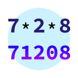
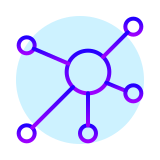

# Exercise icons
Note this file is auto-generated. To re-generate, run `create_icon_gallery.pl` in this folder.

| | | | | |
|:---:|:---:|:---:|:---:|:---:|
|accumulate.svg |acronym.svg |affine-cipher.svg |all-your-base.svg |allergies.svg |
|alphametics.svg |amusement-park-improvements.svg |amusement-park.svg |anagram.svg |anagrams.svg |
|annalyns-infiltration.svg |annalyns-infiltration2.svg |armstrong-numbers.svg |array-loops.svg |assembly-line.svg |
|atbash-cipher.svg |attack-of-the-trolls.svg |authentication-system.svg |bandwagoner.svg |bank-account.svg |
|basics.svg |basketball-website.svg |beauty-salon-goes-global.svg |beer-song.svg |bettys-bike-shop.svg |
|binary-search-tree.svg |binary-search.svg |binary.svg |bird-count.svg |bird-watcher.svg |
|blackjack.svg |bob.svg |bomb-defuser.svg |book-store.svg |booking-up-for-beauty.svg |
|booleans.svg |boutique-inventory-improvements.svg |boutique-inventory.svg |boutique-suggestions.svg |bowling.svg |
|bracket-push.svg |bread-and-potions.svg |building-telemetry.svg |calculator-conundrum.svg |captains-log.svg |
|car-purchase.svg |card-tricks.svg |cars-assemble.svg |change.svg |character-study.svg |
|chessboard.svg |circular-buffer.svg |city-office.svg |clock.svg |collatz-conjecture.svg |
|community-garden.svg |complex-numbers.svg |connect.svg |coordinate-transformation.svg |crypto-square.svg |
|csv-builder.svg |custom-set.svg |custom-signs.svg |darts.svg |date-parser.svg |
|decimal.svg |developer-privileges.svg |diamond.svg |die.svg |difference-of-squares.svg |
|diffie-hellman.svg |dna-encoding.svg |dnd-character.svg |documented-lasagna.svg |dominoes.svg |
|dot-dsl.svg |doubly-linked-list.svg |dungeons-and-dragons.svg |eight-queens.svg |elons-toys.svg |
|elyses-analytic-enchantments.svg |elyses-enchantments.svg |elyses-transformative-enchantments.svg |emoji-times.svg |equilateral-triangle.svg |
|error-handling.svg |errors.svg |etl.svg |exercism-matrix.svg |faceid-2.svg |
|factory-sensors.svg |fibonacci-iterator.svg |file-sniffer.svg |fizz-buzz.svg |fizzy.svg |
|flatten-array.svg |food-chain.svg |football-match-reports.svg |forth.svg |freelancer-rates.svg |
|fruit-picker.svg |futures.svg |german-sysadmin.svg |gigasecond.svg |go-counting.svg |
|grade-school.svg |grains.svg |grep.svg |gross-store.svg |guessing-game.svg |
|hamming.svg |hangman.svg |health-statistics.svg |hello-world.svg |hexadecimal.svg |
|high-school-sweethearts.svg |high-score-board.svg |high-score.svg |high-scores.svg |house.svg |
|hyper-optimized-telemetry.svg |hyperia-forex.svg |hyperinflation-hits-hyperia.svg |instruments-of-texas.svg |interest-is-interesting.svg |
|international-calling-connoisseur.svg |isbn-verifier.svg |isogram.svg |kindergarten-garden.svg |kitchen-calculator.svg |
|knapsack.svg |land-grab-in-space.svg |language-list.svg |largest-series-product.svg |larrys-winning-checker.svg |
|lasagna-master.svg |lasagna.svg |leap.svg |ledger.svg |lens-person.svg |
|library-fees.svg |linked-list.svg |list-ops.svg |log-levels.svg |logs-logs-logs.svg |
|low-power-embedded-game.svg |lucky-numbers.svg |luhn.svg |macros.svg |magazine-cutout.svg |
|magician-in-training.svg |maps.svg |markdown.svg |mask-credit-card.svg |master-mixologist.svg |
|matching-brackets.svg |matrix.svg |meetup.svg |mensch-aergere-dich-nicht.svg |micro-blog.svg |
|microwave.svg |minesweeper.svg |minima.svg |missing-number.svg |mixed-juices.svg |
|movie-goer.svg |moviegoer.svg |name-badge.svg |need-for-speed.svg |newsletter.svg |
|nth-prime.svg |nucleotide-codons.svg |nucleotide-count.svg |nullability.svg |numbers.svg |
|object-relational-mapping.svg |ocr-numbers.svg |octal.svg |ordinal-numbers.svg |orm-in-one-go.svg |
|ozans-playlist.svg |paasio.svg |pacman-rules.svg |pal-picker.svg |palindrome-products.svg |
|pangram.svg |parallel-letter-frequency.svg |parsing-log-files.svg |party-robot.svg |pascals-triangle.svg |
|perfect-numbers.svg |phone-number-analysis.svg |phone-number.svg |pig-latin.svg |pizza-order.svg |
|pizza-pricing.svg |pizza-slices.svg |poetry-club-door-policy.svg |poetry-club.svg |point-mutations.svg |
|poker.svg |pov.svg |prime-factors.svg |prime-number.svg |promises.svg |
|protein-translation.svg |proverb.svg |pythagorean-triplet.svg |queen-attack.svg |rail-fence-cipher.svg |
|raindrops.svg |rational-numbers.svg |react.svg |rectangles.svg |red-vs-blue-darwin-style.svg |
|remote-control-cleanup.svg |remote-control-competition.svg |resistor-color-duo.svg |resistor-color-trio.svg |resistor-color.svg |
|rest-api.svg |reverse-string.svg |rle.svg |rna-transcription.svg |robot-name.svg |
|robot-simulator.svg |role-playing-game.svg |roll-the-die.svg |roman-numerals.svg |rotational-cipher.svg |
|rpn-calculator.svg |run-length-encoding.svg |saddle-points.svg |salary-calculator.svg |santas-helper.svg |
|satellite.svg |savings-account.svg |say.svg |scale-generator.svg |scrabble-score.svg |
|secret-agent.svg |secret-handshake.svg |secrets.svg |secure-munchester-united.svg |semi-structured-logs.svg |
|series.svg |sgf-parsing.svg |short-fibonacci.svg |sieve.svg |simple-calculator.svg |
|simple-cipher.svg |simple-linked-list.svg |slices.svg |socks-and-sexprs.svg |space-age.svg |
|spiral-matrix.svg |square-root.svg |squeaky-clean.svg |stage-heralding.svg |strain.svg |
|strings-package.svg |strings.svg |sublist.svg |sum-of-multiples.svg |take-a-number.svg |
|the-farm.svg |the-weather-in-deather.svg |tim-from-marketing.svg |time.svg |tisbury-treasure-hunt.svg |
|tournament.svg |tracks-on-tracks-on-tracks.svg |translation-service.svg |transpose.svg |tree-building.svg |
|triangle.svg |trinary.svg |twelve-days.svg |two-bucket.svg |two-fer.svg |
|two_product_production_decision.svg |valentines-day.svg |variable-length-quantity.svg |vehicle-purchase.svg |weighing-machine.svg |
|windowing-system.svg |wine-cellar.svg |wizards-and-warriors-2.svg |wizards-and-warriors.svg |word-count.svg |
|word-search.svg |wordy.svg |xorcism.svg |yacht.svg |zebra-puzzle.svg |
|zero-value.svg |zipper.svg |
