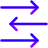

# Key feature icons
Note this file is auto-generated. To re-generate, run `create_icon_gallery.pl` in this folder.

| | | | | |
|:---:|:---:|:---:|:---:|:---:|
|community.svg |concurrency.svg |cross-platform.svg |documentation.svg |dynamically-typed.svg |
|easy.svg |embeddable.svg |evolving.svg |expressive.svg |extensible.svg |
|fast.svg |fun.svg |functional.svg |garbage-collected.svg |general-purpose.svg |
|homoiconic.svg |immutable.svg |interactive.svg |interop.svg |multi-paradigm.svg |
|portable.svg |powerful.svg |productive.svg |safe.svg |scientific.svg |
|small.svg |stable.svg |statically-typed.svg |tooling.svg |web.svg |
|widely-used.svg |
