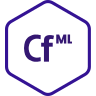
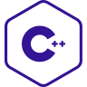
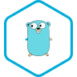
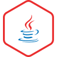
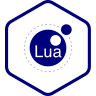
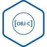
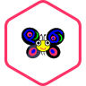
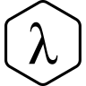

# Gallery of SVGs in this folder
Note this file is auto-generated. To re-generate, run `create_icon_gallery.pl` in this folder.

| | | | | |
|:---:|:---:|:---:|:---:|:---:|
|05ab1e.svg |ada.svg |arm64-assembly.svg |babashka.svg |ballerina.svg |
|bash.svg |c.svg |ceylon.svg |cfml.svg |clojure.svg |
|clojurescript.svg |coffeescript.svg |coldfusion.svg |common-lisp.svg |coq.svg |
|cpp.svg |crystal.svg |csharp.svg |d.svg |dart.svg |
|delphi.svg |ecmascript.svg |elixir.svg |elm.svg |emacs-lisp.svg |
|erlang.svg |factor.svg |forth.svg |fortran.svg |fsharp.svg |
|gleam.svg |gnu-apl.svg |go.svg |groovy.svg |haskell.svg |
|haxe.svg |idris.svg |io.svg |j.svg |java.svg |
|javascript.svg |julia.svg |kotlin.svg |lfe.svg |lua.svg |
|mips.svg |nim.svg |nix.svg |objective-c.svg |ocaml.svg |
|perl5.svg |pharo-smalltalk.svg |php.svg |plsql.svg |pony.svg |
|powershell.svg |prolog.svg |purescript.svg |python.svg |r.svg |
|racket.svg |raku.svg |reasonml.svg |red.svg |ruby.svg |
|rust.svg |scala.svg |scheme.svg |shen.svg |sml.svg |
|solidity.svg |swift.svg |systemverilog.svg |tcl.svg |typescript.svg |
|vb-net.svg |vbnet.svg |vimscript.svg |wren.svg |x86-64-assembly.svg |
|z3.svg |zig.svg |
